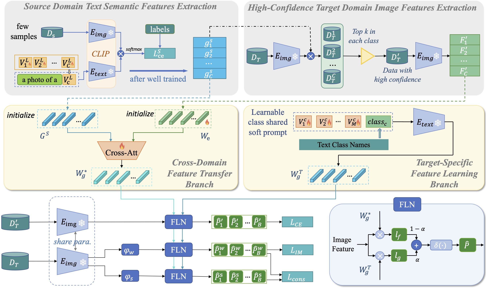

# Data-Efficient CLIP-Powered Dual-Branch Networks for Source-Free Unsupervised Domain Adaptation

Official implementation of CDBN(CLIP-powered Dual-Branch Network)[[Paper](https://arxiv.org/abs/2410.15811)]

## Overview

Architecture of Network.


## Requirements

Our code is based on the [Dassl library](https://github.com/KaiyangZhou/Dassl.pytorch), please install the Dassl library before running this code.

```bash

conda install pytorch==1.10.1 torchvision==0.11.2 cudatoolkit==11.3 -c pytorch
```

## Training

The training process consists of two main stages:

Stage 1: Few-shot training on the source domain to obtain a source-free model.

Stage 2: Adaptation of the model to the target domain for optimal performance.

```bash

python train_sfda.py --trainer Source_adapter --dataset-config-file /home/CDBN/configs/datasets/office_homea2p.yaml --config-file /home/CDBN/configs/trainers/rn50.yaml --output-dir /home/CDBN/output/office/source --cls-rate 0.2 --num-shots-source 8
python train_sfda.py --trainer Clip_adapter_target --dataset-config-file /home/CDBN/configs/datasets/office_homea2p.yaml --config-file /home/CDBN/configs/trainers/rn50.yaml --output-dir /home/CDBN/output/office/rn50 --init-weights /home/CDBN/output/office/source --cls-rate 0.2 --fixmatch 1.0 --im-weight 0.0 --im-minus 1.0 --parameter-alpha 0.5 --xshots 8 --freeze-class 
```

## Citation

```bibtex

@article{li2024data,
  title={Data-Efficient CLIP-Powered Dual-Branch Networks for Source-Free Unsupervised Domain Adaptation},
  author={Li, Yongguang and Cao, Yueqi and Li, Jindong and Wang, Qi and Wang, Shengsheng},
  journal={arXiv preprint arXiv:2410.15811},
  year={2024}
}
```

## Acknowlegdement

<!-- This code is built on [Dassl](https://github.com/KaiyangZhou/Dassl.pytorch), we thank the authors for sharing their code.

This code is built on [Dassl](https://github.com/KaiyangZhou/Dassl.pytorch), and we thank the authors for sharing their code. We also extend our gratitude to the authors of FixMatch, CoOp, and LAMM for their contributions to the deep learning community. -->


This code is built on [Dassl](https://github.com/KaiyangZhou/Dassl.pytorch). We thank the authors for sharing their code. We also express our gratitude to the authors of the following open-source repositories for their valuable contributions: [FixMatch](https://github.com/google-research/fixmatch), [CoOp](https://github.com/KaiyangZhou/CoOp), and [LAMM](https://github.com/gaojingsheng/LAMM).